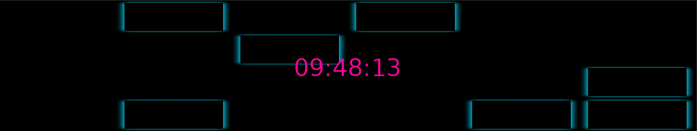
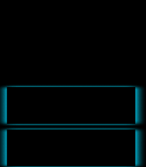
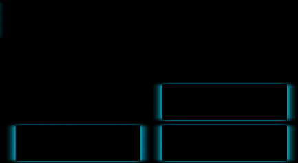

# Studienleistung II: GraphicsApp | Binary Clock

## Allgemeine Hinweise zur Studienleistung
In dieser Studienleistung werden Sie eine Programmieraufgabe lösen.
Diese Programmieraufgaben besteht aus einem Projekt
* ```Studienleistung-II-BinaryClock```

Nutzen Sie zum Lösen der Aufgabe die bereitgestellte Klassendatei als Einstiegspunkt und fügen Sie weitere Klassen nach Bedarf hinzu.
Zum Einreichen Ihrer Aufgabe nutzen Sie die entsprechende Funktion in GRIPS.
Falls Sie Problemen mit dem Starterpaket oder dem Einreichen der Aufgabe haben, können Sie sich in den Handouts auf GRIPS informieren.

Achtung: Eine Verlängerung der Abgabefrist ist nicht möglich.
Einreichungen, die uns (zu spät) per E-Mail erreichen, werden nicht mehr berücksichtigt.
Alle nicht eingereichten Aufgaben werden mit nicht bestanden bewertet.
Testen Sie den Upload am besten schon vor Ablauf der Frist in Ruhe: Sie können bis zum Abgabetermin beliebig viele neue Lösungen einreichen.

Bewertungskriterien: Für die gesamte Studienleistung gilt, dass die eingereichten Lösungen nur die in der Aufgabenstellung beschriebenen Probleme lösen sollen.
Lassen Sie keinen Teil der jeweiligen Aufgabe weg und interpretieren Sie die Fragestellung nicht selbstständig.
Bewertet wird, in wie weit Sie das beschriebene Problem vollständig lösen.
Wenn Sie die Aufgaben erfolgreich bearbeitet haben, können Sie Ihre Lösung gerne kreativ gestalten und erweitern; achten Sie dabei darauf, dass die eigentlichen Anforderungen weiterhin erfüllt bleiben.
Die Qualität Ihres Codes fließt in die Gesamtnote mit ein: Nutzen Sie Decomposition um Ihre Programme übersichtlich zu gestalten.
Verwenden Sie sinnvolle Bezeichner für Variablen und Methoden und kommentieren Sie ausreichend.
Beachten Sie dazu die Kriterien für guten und schlechten Code, die in der Vorlesung erwähnt wurden.

Sollten Sie Fragen haben oder Hilfe brauchen, können Sie im Discord unter der Kategorie Support in den Channel Studienleistung uns eine Nachricht hinterlassen.
Wir stehen Ihnen dann zeitnah zur Seite über eine Direktnachricht.

# Binary Clock

## Ausgangslage
Im Rahmen dieser Aufgabe implementieren Sie eine Uhr, die die aktuelle Uhrzeit in Binärdarstellung anzeigt.
Über diese Binärdarstellung soll die aktuelle Uhrzeit ebenfalls anhand einer Digitaluhr dargestellt werden.



Die Ausgangsbedingung für diese Aufgabe ist wie folgt:

Sie implementieren ausgehend von einer leeren *GraphicsApp* die Binäruhr.

## Anforderungen

Folgende Anforderungen muss die Binäruhr für diese Aufgabe erfüllen:
* Die Klasse ```BinaryClockApp``` muss als Einstiegspunkt in Ihr Programm verwendet werden
* Die Darstellung der Binäruhr soll als Grid mit **sechs** Spalten und **vier** Reihen erfolgen
* Von links nach rechts werden jeweils **zwei** Spalten als **Spaltenpaar** für die Anzeige von Stunden, Minuten und Sekunden benötigt.
* Die linke Spalte eines Spaltenpaares repräsentiert die Zehnerstelle und die rechte Spalte die Einerstelle (analog zur bekannten Digitaluhr)
* Da die Binärdarstellung weniger Ziffern hat (0 und 1) als die Dezimaldarstellung (0-9) werden pro Spalte **vier** Reihen benötigt, um die Zeit, repräsentiert als Zahl, darstellen zu können
  * Die Felder einer Spalte stehen demnach für konkrete Ziffern
    * Von unten nach oben 1, 2, 4, 8
    * bildliches Beispiel:
    
      
    
      Hier sind die beiden unteren Felder oder Bits der Spalte gesetzt. 
      Das heißt, wenn man jetzt deren Werte aufsummiert
      1 * **1** + 1 * **2** + 0 * **4** + 0 * **8** = **3**.
      Der Wert für diese Spalte und die jeweilige Stelle (Zehner- oder Einerstelle), die die Spalte repräsentiert, ist demnach **3**.
    * Beispiel für ein Spaltenpaar, das als Repräsentation von Stunden, Minuten oder Sekunden verwendet werden kann:
      
      
      
      Interpretiert wäre es die **13.** Stunde, Minute oder Sekunde, weil die linke Spalte (Zehnerspalte) aufsummiert **1** ergibt und die rechte Spalte (Einerspalte) **3** ergibt.
  * Verwendet man **drei** solcher Spaltenpaare kann auf diese Weise demnach die Zeit auf binäre Weise im Format hh:mm:ss dargestellt werden.
* Laden Sie das Bild in ```data/assets``` als Instanz der Klasse ```Image```, um ein Feld in der Binäruhr zu visualisieren
* Verwenden Sie die Klasse ```Label```, um die aktuelle Zeit als Digitaluhr über die Binäruhr zu zeichnen ([Dokumentation der Klasse Label](https://oop-regensburg.github.io/GraphicsApp-Reborn-Library/html/classde_1_1ur_1_1mi_1_1oop_1_1graphics_1_1_label.html))
* Verwenden Sie ```LocalDateTime now = LocalDateTime.now();```, um die aktuelle Zeit von Java in der Variable ```now``` zu erhalten
* Wenden Sie das Prinzip ```Decomposition``` an
* Verwenden Sie sinnvolle Datenstrukturen (z.B. ```Array``` oder ```Array of Arrays```)

## Hinweise
* Benutzen Sie das Objeckt der Klasse LocalDateTime (oben gennant ```now```), um die Stunden, Minuten und Sekunden als Integers (```int```) zu speichern:

  ```java
  hours   = now.getHour();
  minutes = now.getMinute();
  seconds = now.getSecond();
  ```
* Machen Sie sich vertraut mit den konkreten Unterschieden der Divisionsoperatorn ```/``` und ```%```, um die Zehner- und Einerstellen aus ```hours, minutes, seconds``` zu speichern 
* Denken Sie daran, dass Sie Variablen des Datentyps ```int``` an Objekte des Typs ```String``` anhängen können (```+```-Operator). Das gilt auch für leere Objekte des Typs ```String``` (```""```) ([Dokumentation der Klasse String](https://docs.oracle.com/javase/7/docs/api/java/lang/String.html))
  * Beispiel: Die Variable `str` speichert einen leeren String (`""`). "Addiert" bzw. fügt man nun z.B. eine Variable des Typs `int`, `float`, `String` hinzu (`+`-Operator), dann steht in der der Variable `str` der ursprüngliche Wert von `str` und der Wert der anderen Variable, welcher an das vorherige Ende von `str` angefügt wurde.
  ```java
        String str = "";
        str += 5;
        // str hat den Wert "5";
        str += 5.5f;
        // str hat den Wert "55.5"
        str += "Hello World";
        // str hat den Wert "55.5Hello World"
    ```
* Die Farbe der Digitaluhr über der Binäruhr ist *Neon Pink* mit RGB: 254, 1, 154.

## Ideen für Erweiterungen
```Wenn Sie die Aufgaben erfolgreich bearbeitet haben, können Sie Ihre Lösung gerne kreativ gestalten und erweitern; achten Sie dabei darauf, dass die eigentlichen Anforderungen weiterhin erfüllt bleiben.```

* Erweiterungen sind komplett optional
* Ideen für Erweiterungen:
  * Zusätzliche Modi für die Uhr:
    * Stoppuhr
    * Countdown
  * Zeitzone einstellen
  * etc.
